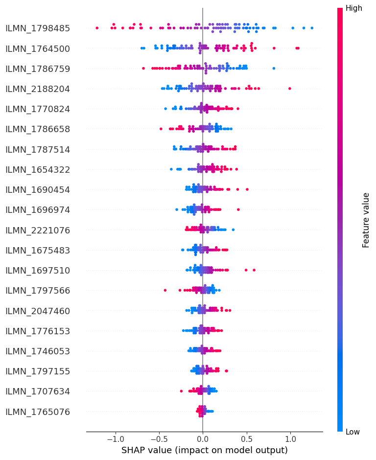

# Alzheimer’s Blood Transcriptomic ML Pipeline 🧬🧠  
*A journey into blood transcriptomics and machine learning for Alzheimer’s*  

---

## Why I built this
Alzheimer’s is one of the toughest health challenges of our time.  
I was curious: **can we detect Alzheimer’s just from a person’s blood gene expression?**  

So I took a real dataset from the Gene Expression Omnibus (**GSE63060** on platform **GPL6947**),  
and built a full machine learning pipeline — from raw probes to an interpretable **20-gene signature**.  

---

## What I did
- Downloaded and parsed GEO data (expression + metadata).  
- Mapped **Illumina probes → gene symbols**.  
- Compared **baseline logistic regression** vs **XGBoost**.  
- Used **SHAP** to find the most important probes.  
- Distilled it down to a compact **20-gene logistic regression model**.  
- Validated with **5-fold cross-validation**, making sure feature selection stayed **inside each fold** (to avoid leakage).  

---
## Results 
## Results (20-gene Signature)

- ROC AUC = **0.806**
- PR AUC = **0.841**

**ROC Curve**  


**Precision–Recall Curve**  


**Confusion Matrix (best F1 threshold)**  


## Interpretability (SHAP)

Understanding *why* the model makes predictions is crucial in healthcare ML.  
I used **SHAP** to explain the 20-gene logistic regression model:

**SHAP Summary Plot (20-gene model)**  



---

## How to run it
1. Clone this repo.  
2. Create a virtual environment and install requirements:  
   ```bash
   python -m venv .venv
   source .venv/bin/activate
   pip install -r requirements.txt
   ```
3. Download the GEO dataset into `data/` .  
4. Open and run `notebooks/alz_detect.ipynb`.  
5. Check outputs in `reports/figures/` and models in `models/`.  
